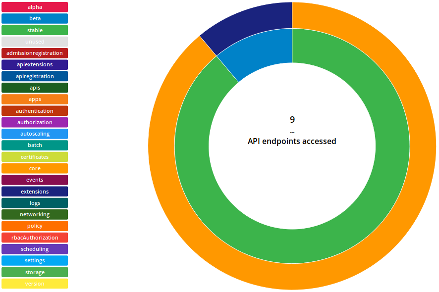
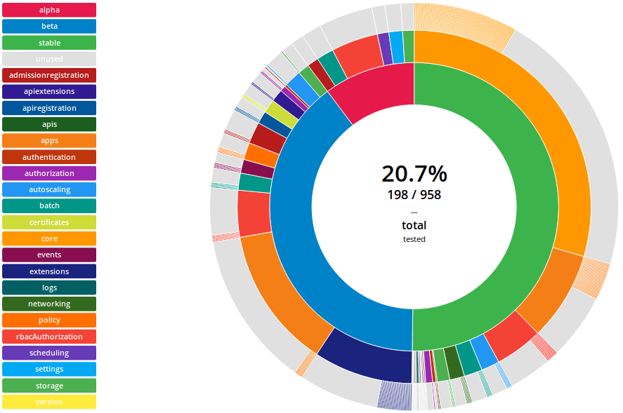

# apisnoop

Snooping on the Kubernetes OpenAPI communications

## Enabling Audit Logging

### GCE / terraform+kubeadm

We [modified](https://github.com/GoogleCloudPlatform/terraform-google-k8s-gce/pull/13/files) [GoogleCloudPlatform/terraform-google-gce](https://github.com/GoogleCloudPlatform/terraform-google-k8s-gce) to use the AdvancedAuditing / Audit feature gates available in kubernetes/kubeadm.
Thanks @danisla!

To utilize it, create a tf config using the above module.
Be sure to set your project and location.

```terraform
# save as my-auditable-cluster.tf
provider "google" {
  project     = "ii-coop"
  region      = "us-central1"
}
module "k8s" {
  source      = "github.com/ii/terraform-google-k8s-gce?ref=audit-logging"
  name        = "apisnoop"
  k8s_version = "1.10.2"
}
```

We can monitor our cloud-init progress on the master, then collect the audit logs directly from the apiserver (easier if we only have one master).

```
terraform init
terraform apply
MASTER_NODE=$(gcloud compute instances list | grep apisnoop.\*master | awk '{print $1}')
gcloud compute ssh $MASTER_NODE --command "sudo tail -f /var/log/cloud-init-output.log /var/log/cloud-init.log"
# master node is up when you see: service "kubernetes-dashboard" created
```

Find the apiserver container and tail the audit log to see every api request.

```
gcloud compute ssh $MASTER_NODE --command "sudo docker exec \$(sudo docker ps -a | grep kube-apiserver-amd64 | awk '{print \$1}') tail -f /var/log/kubernetes/audit/audit.log"
```

### Packet / kubicorn+kubeadm

The [packet/kubicorn walkthru](https://github.com/kubicorn/kubicorn/blob/master/docs/_documentation/packet-walkthrough.md) from @deitch only needs some minor changes.

We created a ./bootstrap/ folder with updated scripts to enable audit-logging

```
git clone https://github.com/cncf/apisnoop.git
cd apisnoop
export PACKET_APITOKEN=FOOBARBAZZ
export KUBICORN_FORCE_LOCAL_BOOTSTRAP=1
kubicorn create apisnoop --profile packet
# edit ./_state/apisnoop/cluster.yaml
# ensure clusterAPI.spec.providerConfig: project.name is set correctly
kubicorn apply apisnoop
```

-----
## Auditing your KAPIC
kubectl create namespace
kubectl create sa
./tail the audit into > my.log
helm magic and push
-C
/**

### Loading audit logs into apisnoop

Once you have the audit logs for the app, you can turn them into an interactive graph of the endpoints and methods that were requested by the app.

Some setup is required
```
cd dev/audit-log-review
pip install -r requirements.txt
```

To load the audit log into the database
```
python logreview.py load-audit <audit log path> <app name>
```

Now that the log is in the database, lets start the webserver and have a look
```
python logreview.py start-server
```

Go to `http://localhost:9090` in a web browser

Click `Apps` then the app name and you will get a graph that looks similar to this:



### Loading e2e coverage test audit logs

To see the coverage graph from the Kubernetes e2e tests obtained from Sonobuoy or manually, load the logs using the name **e2e**
```
python logreview.py load-audit <audit log path> e2e
```

Now start the webserver
```
python logreview.py start-server
```
and go to `http://localhost:9090` in a web browser

Click `e2e` and you will get a graph that looks similar to this:



### Exporting data

If you want to export data as csv files

```
python logreview.py export-data <exporter name> <output csv path> <app name>
```
`exporter name` can be one of:

- **app-usage-categories**: breakdown of API categories an app is using
- **app-usage-summary**: summary of alpha / beta / stable API usage
- **app-usage-endpoints**: a list of endpoints and methods the app connects to
- **coverage-spreadsheet**: combines conformance google sheets data with endpoint hit counts

From the CSV, you can easily preview in terminal by using the command

`cat <output csv path> | tr "," " " | column -t`

Example output


-----

## Overview

We are aiming to create a tool to measure OpenAPI usage and test coverage in a generic way.

Kubernetes API coverage is currently generated from parsing e2e test logs. The Conformance WG is focused on getting the e2e tests from ~11% to much higher API test coverage. However we have no API usage data from applications or addons to prioritize what tests to write next.

If we intercept addon API usage we could prioritize test writing and additionally determine if applications are alpha/beta/stable conformant for a specific Kubernetes release.

We propose a man-in-the-middle (MITM) proxy that intercepts the API requests of the Kubernetes e2e test and addons, comparing them against the API server’s OpenAPI documentation. The results would be made available to via HTTP per deployment or pod.

Initial proof of concept here: https://github.com/ii/kube-apisnoop

## Definitions
Coverage is defined as the percentage of the overall API surface area utilized by the e2e test or addon, including alpha/beta/stable for a specified Kubernetes release.

## Approach
The coverage tester is implemented as an HTTPS Reverse Proxy allowing inspection all of the HTTPS traffic between the clients (e2e or addon) and the API server. The API requests are compared with the Swagger/OpenAPI specification and used to calculate API coverage.

There is existing work in intercepting HTTPS traffic, and we suggest basing the work on https://github.com/danisla/kubernetes-tproxy

This would allow us to route API server traffic to a sidecar proxy via an initializer and create a CSR signed by k8s matching the CN of the endpoint.

It should be somewhat trivial to add support for a centralized proxy OR aggregate the existing per pod proxy sidecar. Whatever solution, we want to allow adding a per pod header for aggregation purposes.

The primary logging logic will be written as an MITM addon inspecting HTTP response objects log for method, path, response code, and request/response bodies.

Note that headers will not be recorded as they are not needed and often contain tokens and other sensitive information.

### Action performed by test agent:

* Deploy man in the middle coverage proxy via helm chart.
* Add annotation for API Coverage testing when deploying addon via helm
* Results available via HTTP to coverage proxy service via pod / chart name.

### Actions performed by coverage proxy:

* Load the Swagger Spec for the target API endpoint
* Watch for pods created with API Coverage annotation
* Redirect pod API traffic using iptables rules and/or set http[s]_proxy var
* Compare request and response sets from pods against swagger spec
* Note which methods / endpoints / fields have been “hit” correctly (or incorrectly)
* Note when unknown api calls/fields are used
* Continually update the coverage result and make it available via HTTP
